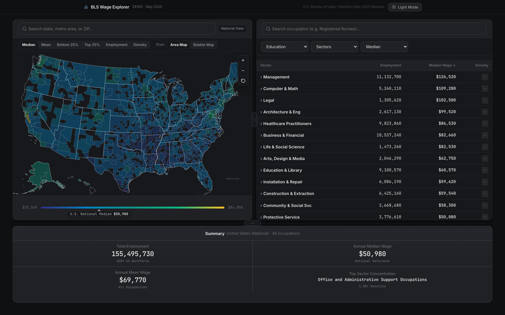
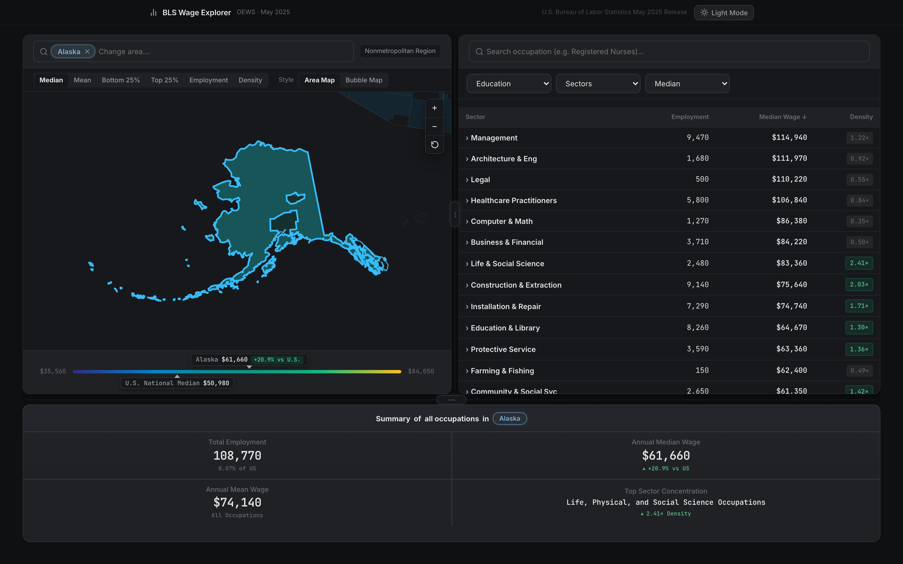
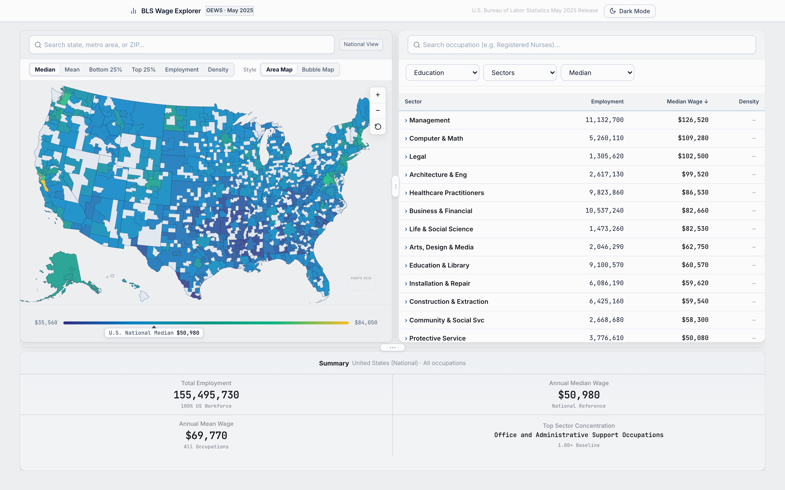

# BLS Wage Explorer

An interactive map + browser for U.S. occupational wages, built on the
Bureau of Labor Statistics **OEWS (May 2025)** release. Pick any state, metro
area, non‑metropolitan region, or ZIP code and see how ~800 occupations across
22 career sectors pay there — against the national baseline, by percentile,
and by how concentrated each field is in that local economy.

**Live:** <https://bls.riverakarom.com>

<p align="center">
  
</p>

---

## What it does

| | |
|---|---|
| **National → local** | Start on a county‑level choropleth of the whole country, then search a state / metro / non‑metro area / 5‑digit ZIP to zoom to it and re‑scope every panel. |
| **Six lenses on the same geography** | Median, Mean, Bottom 25% (P25), Top 25% (P75), Employment, and **Density** (location quotient — how over/under‑represented a field is locally vs nationally). |
| **Two map styles** | Area choropleth or proportional bubbles. |
| **Sector browser** | The right panel opens on the 22 SOC major groups; drill a sector → its occupations → per‑region breakdown for one occupation, with a breadcrumb the whole way down. |
| **Comparison built in** | Every wage is shown with its delta vs the U.S. figure; the legend pins both the selected area and the national marker on a shared gradient. |
| **Summary tearsheet** | A fixed panel under the map: total employment, annual median, annual mean, and the area's top sector concentration — each with its "vs U.S." line. |

<p align="center">
  
  
</p>

---

## How it's built

- **One file, no build step.** The entire client is `index.html` (~6,000 lines of
  vanilla HTML/CSS/JS — no framework, no bundler, no dependencies shipped to the
  browser).
- **Hand‑rolled SVG map.** An Albers‑USA projection (`viewBox="0 0 975 610"`)
  with a `<g>` zoom/pan group; choropleth, bubble, and selected‑region overlay
  layers are toggled in place.
- **Static data, fetched on demand.** The app makes **zero calls to bls.gov at
  runtime.** It reads pre‑built JSON from `data/` — a manifest plus one file per
  area, loaded lazily as you navigate. Occupation‑by‑region breakdowns and map
  colour data are split into per‑SOC and per‑year files so first paint stays small.
- **Deploy:** Cloudflare Workers static assets. `npx wrangler@4 deploy` from this
  folder publishes to the custom domain. `.assetsignore` keeps the data pipeline,
  source spreadsheets, and docs out of the bundle.

### Data pipeline (`scripts/`)

The published `data/` directory is generated offline from the BLS source
spreadsheets in `bls_data/` (git‑ignored — ~80 MB each, re‑downloadable from the
BLS OEWS "All Data" release). Nothing here runs in production.

| Step | Script | In → Out |
|---|---|---|
| 1 | `process_bls.py <year>` | `bls_data/all_data_M_<year>.xlsx` → `data/<year>/areas/*.json`, `areas.json` |
| 2 | `build_all_statistical_areas.mjs` | CBSA↔county crosswalk + county atlas → `data/metro_shapes.json` (MSA + non‑metro polygons) |
| 3 | `build_metro_map_data.py <year>` | per‑area data + shapes → `data/<year>/jobs/*.json`, `metro_map.json` |
| 4 | `build_place_index.py` | US‑cities CSV + crosswalk → `data/place_index.json` (ZIP / city → area) |

Full notes: [`scripts/README.md`](scripts/README.md).

---

## Run it locally

No install needed — just serve the folder statically so `fetch()` can read `data/`:

```bash
cd bls
python3 -m http.server 8000
# open http://localhost:8000
```

Regenerating data additionally needs Python 3 (stdlib only) and, for step 2,
Node with `d3-geo` + `topojson-client` (already in `node_modules/`).

---

## Project structure

```
bls/
├── index.html            markup + layout
├── css/
│   └── styles.css        design system and map styles
├── js/
│   ├── app.js            map logic, interactivity, and UI
│   └── constants.js      static arrays and configurations
├── data/                 generated JSON served to the client
│   ├── areas.json        area manifest
│   ├── <year>/areas/     one file per state / metro / non-metro area
│   ├── <year>/jobs/      per-occupation regional breakdowns
│   ├── metro_shapes.json MSA + non-metro polygons
│   └── place_index.json  ZIP / city → area lookup
├── scripts/              offline data pipeline (not deployed)
├── bls_data/             raw BLS .xlsx sources (git-ignored, not deployed)
└── wrangler.jsonc        Cloudflare static-assets deploy config
```

---

## Data source & accuracy

All figures come from the **BLS Occupational Employment and Wage Statistics
(OEWS)** program, May 2025 estimates. Wages are annual unless a field is only
reported hourly, in which case the app says so. Suppressed cells are shown as
withheld rather than guessed. The client never mutates the source data — it only
reads the committed JSON.

## License

Proprietary — see [`LICENSE`](LICENSE). Published for portfolio review only; no
reuse, redistribution, or commercial use without written permission.
